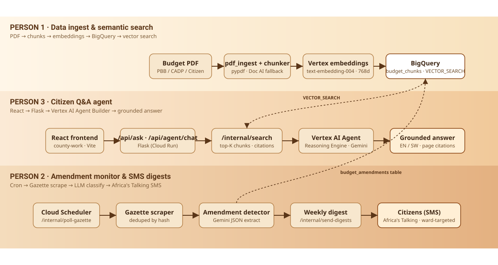

<div align="center">
  

  <p>
    <strong>Ask Nairobi County's budget in plain language.</strong><br/>
    Grounded answers with page citations &middot; weekly SMS digests &middot; gazette-amendment monitoring.
  </p>

  <p>
    
    
    
    
    
    
    
  </p>
</div>

---

## Live demo

| | URL |
|---|---|
| **Web app** | https://nbo-budget-frontend-1085978218679.us-central1.run.app |
| **Backend API** | https://nbo-budget-backend-1085978218679.us-central1.run.app |
| **Health check** | https://nbo-budget-backend-1085978218679.us-central1.run.app/health |

Both services run on Cloud Run in `us-central1` (project `bwai-agentathon`). The frontend's nginx forwards `/api/*` to the backend, so the SPA calls same-origin.

---

## Why this exists

Kenya's county budget documents are PDFs running into hundreds of pages, written in finance-speak. A resident who wants to know how much was allocated to a road in their ward has to read line items, follow gazette amendments, and translate jargon, or just give up.

This project gives them three doors instead:

1. **A web Q&A agent** that answers natural-language questions with citations to the source PDF.
2. **A gazette monitor** that watches the Kenya Gazette and flags amendments that change ward allocations.
3. **A weekly SMS digest** for residents without internet, in English or Kiswahili.

---

## Architecture



Everything runs on Google Cloud: BigQuery for chunk + vector storage, Vertex AI for embeddings and the agent, Cloud Run for the Flask backend and the React frontend, Cloud Scheduler for cron triggers, and Africa's Talking for the SMS leg.

---

## The three-person split

| Lane | Owner | Surface | Highlights |
|---|---|---|---|
| **Ingest &amp; search** | Person 1 | `POST /internal/search` | PDF → chunks → Vertex embeddings (`text-embedding-004`, 768d) → BigQuery `budget_chunks` → `VECTOR_SEARCH` (cosine). Idempotent ingest keyed by content-hash `doc_id`. |
| **Citizen agent** | Person 3 | `POST /api/ask`, `POST /api/agent/chat` | Multi-turn Q&A grounded on `/internal/search`. Vertex AI Agent Builder / Reasoning Engine with EN/SW post-processing, mock fallback when Vertex isn't configured. |
| **Gazette + SMS** | Person 2 | `POST /api/subscribe`, `POST /api/sms/inbound`, `GET /api/amendments`, `POST /internal/poll-gazette`, `POST /internal/send-digests` | Cron-driven gazette polling → Gemini JSON extraction → BigQuery `budget_amendments`. Weekly SMS digests via Africa's Talking, with phone validation. |

---

## Repository layout

```text
agentathon-24/
├── backend/                  ─ Flask app served by gunicorn on Cloud Run
│  ├── app/
│  │  ├── __init__.py         ─ app factory; registers all blueprints
│  │  ├── config.py           ─ unified Config (all env vars)
│  │  ├── routes/             ─ health, internal/search, ask, agent, subscribe, sms, amendments
│  │  └── services/
│  │     ├── bq.py            ─ vector_search + Person 2 BQ helpers
│  │     ├── chunker.py       ─ PDF chunking
│  │     ├── embeddings.py    ─ Vertex embeddings (token-aware batching + retry)
│  │     ├── pdf_ingest.py    ─ pypdf + Document AI fallback
│  │     ├── agent_builder.py ─ Vertex AI Reasoning Engine client
│  │     ├── gazette.py       ─ gazette scrape
│  │     ├── amendments.py    ─ LLM JSON extractor
│  │     ├── sms.py           ─ Africa's Talking client
│  │     └── digest.py        ─ weekly digest builder
│  ├── scripts/
│  │  └── ingest_budget.py    ─ one-shot ingest CLI
│  ├── sql/schema.sql         ─ BigQuery table DDL (reference)
│  ├── Dockerfile             ─ python:3.12-slim + gunicorn
│  └── requirements.txt
│
├── frontend/county-work/     ─ React + Vite SPA, served by nginx on Cloud Run
│  ├── src/
│  │  ├── App.jsx             ─ hero search, answer panel, subscribe form
│  │  ├── api.js              ─ same-origin fetch helpers
│  │  └── index.css           ─ brown/glass palette
│  ├── nginx.conf.template    ─ envsubst'd at boot; proxies /api/* to backend
│  ├── Dockerfile             ─ node:22 build → nginx:alpine serve
│  └── vite.config.js         ─ dev-server proxy for /api + /health
│
└── docs/assets/              ─ logo.svg, architecture.svg
```

---

## Quick start (local)

### Backend

```bash
cd backend
python -m venv .venv && . .venv/Scripts/activate   # or `source .venv/bin/activate` on Linux/macOS
pip install -r requirements.txt
cp .env.example .env                                # then fill in GCP_PROJECT_ID etc.

# one-shot: ingest a budget PDF into BigQuery
python scripts/ingest_budget.py --pdf "../2024-25-FY-Budget-Submission-PBB-DRAFT Nairobi.pdf"

# run the API
python wsgi.py    # http://localhost:8080
```

### Frontend

```bash
cd frontend/county-work
npm install
npm run dev       # http://localhost:5173, /api/* is proxied to localhost:8080
```

---

## Deploy to Cloud Run

The repo is set up so the whole stack can be deployed with two commands.

### 1. Backend

```bash
gcloud run deploy nbo-budget-backend \
  --source backend \
  --region us-central1 \
  --allow-unauthenticated \
  --set-env-vars GCP_PROJECT_ID=$PROJECT,BQ_DATASET=county_budget,VERTEX_LOCATION=us-central1
```

Cloud Build picks up `backend/Dockerfile`, builds the image, and Cloud Run rolls it out. The service URL it prints is what the frontend will proxy to.

### 2. Frontend

```bash
BACKEND_URL=$(gcloud run services describe nbo-budget-backend \
  --region us-central1 --format='value(status.url)')

gcloud run deploy nbo-budget-frontend \
  --source frontend/county-work \
  --region us-central1 \
  --allow-unauthenticated \
  --set-env-vars BACKEND_URL=$BACKEND_URL
```

`BACKEND_URL` is read by nginx at container start (the `nginx:alpine` base image runs `envsubst` over anything in `/etc/nginx/templates/`), so the frontend forwards `/api/*` to whichever backend you point it at — no rebuild required if you redeploy the backend.

---

## API reference

| Method | Path | Purpose | Auth |
|---|---|---|---|
| `GET`  | `/health` | Liveness probe | open |
| `POST` | `/api/ask` | One-shot Q&amp;A grounded on the budget PDF | open |
| `POST` | `/api/agent/chat` | Multi-turn agent chat | open |
| `POST` | `/api/subscribe` | Subscribe a phone (E.164) to SMS digests | open |
| `POST` | `/api/unsubscribe` | Unsubscribe a phone | open |
| `POST` | `/api/sms/inbound` | Africa's Talking inbound webhook | webhook |
| `GET`  | `/api/amendments` | List detected budget amendments (filterable by `ward`) | open |
| `POST` | `/internal/search` | Vector-search budget chunks | internal |
| `POST` | `/internal/poll-gazette` | Cron: scrape gazette + detect amendments | `X-Internal-Token` |
| `POST` | `/internal/send-digests` | Cron: send weekly SMS digests | `X-Internal-Token` |

#### `POST /api/ask`

```json
{ "question": "How much was allocated to roads in Kasarani?", "ward": "Kasarani", "lang": "en" }
```

```json
{
  "answer": "Kasarani ward received KES 142M for road maintenance ...",
  "citations": [{ "page": 87, "section": "Roads & Public Works" }],
  "ward": "Kasarani",
  "lang": "en",
  "chunks_used": 6
}
```

---

## Authors

- **Person 1** — Ingest pipeline &amp; vector search ([@kiragu-maina](https://github.com/kiragu-maina))
- **Person 2** — Gazette monitor &amp; SMS digests ([@isaack205](https://github.com/isaack205))
- **Person 3** — Citizen agent &amp; frontend ([@Lil-mast](https://github.com/Lil-mast))

Built for the GDG Nairobi Agentathon 2024.
